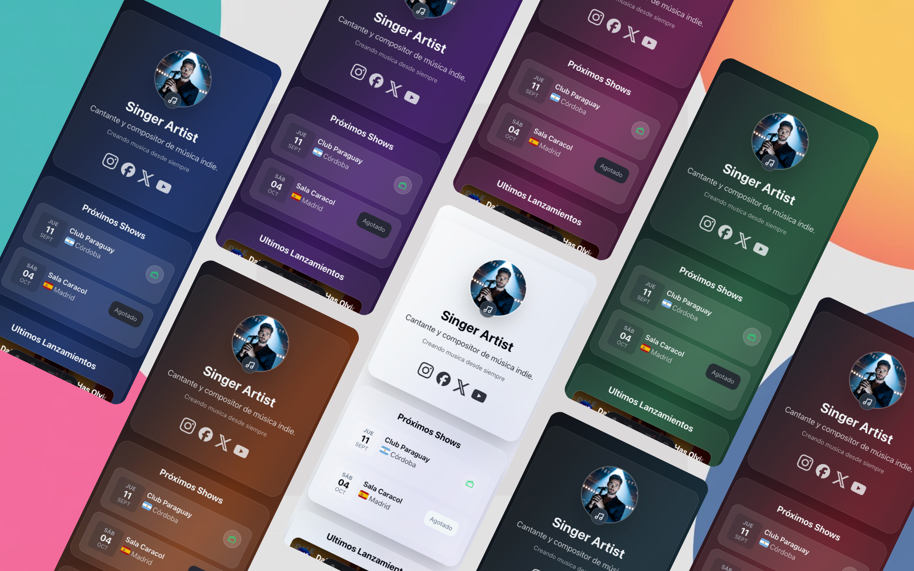

# ArtisTree – Link in Bio Page para Artistas 🎶
[](LICENSE)
[](https://astro.build/)
[](https://tailwindcss.com/)
[](https://app.netlify.com/projects/artistree-astro/deploys)



ArtisTree es una **landing page personalizable para artistas musicales**.  
Funciona como un “link-in-bio” moderno para redes sociales: concentra links a tus plataformas (Spotify, Apple Music, YouTube, etc.), próximos shows, lanzamientos y contactos de booking.  

Está construida con **[Astro](https://astro.build/)** + **TailwindCSS v4**, y pensada para ser fácilmente configurable por medio de un solo archivo: `src/data/site.json`.

## 🚀 Demo
👉 [Ver demo](https://artistree-astro.netlify.app/)


---

## 🚀 Quick Start

1. **Clonar el repositorio**
   ```bash
   git clone https://github.com/francosuarez-dev/artistree.git
   cd artis-tree
   ```

2. **Instalar dependencias**
   ```bash
   npm install
   ```

3. **Levantar el entorno de desarrollo**
   ```bash
   npm run dev
   ```
   El sitio quedará disponible en `http://localhost:4321`

4. **Build para producción**
   ```bash
   npm run build
   npm run preview
   ```

---

## 📦 Configuración desde `site.json`

Toda la configuración está centralizada en:

```
src/
  data/
    site.json   ← aquí editás todo
```

> Alternativa avanzada: si querés “imports” de imágenes optimizadas de Astro, podés usar `src/data/site.ts` y exportar un objeto tipado (ver sección **Imágenes**).

---

## 🧰 Estructura general

```jsonc
{
  "config": {
    "title": "Artistree Landing",
    "description": "Landing en Astro",
    "theme": "violet",             // uno de: light | dark | violet | blue | green | red | pink | orange
    "copyright": "© 2025 ..."
  },

  "artist": {
    "name": "Franco Suárez",
    "description": "Cantante y compositor...",
    "bio": "Texto corto...",
    "picture": "/covers/profile.jpeg" // ver sección Imágenes
  },

  "socials": {
    "instagram": "https://instagram.com/...",
    "facebook": "https://facebook.com/...",
    "x": "https://x.com/...",
    "youtube": "https://youtube.com/..."
    // opcionales: spotify, applemusic, tidal, whatsapp, email, website ...
  },

  "booking": {
    "email": "booking@franco.com",
    "phone": "+54 911 2345 6789"
  },

  "shows": [
    {
      "title": "Nombre del show",
      "date": "2025-09-12",          // ISO YYYY-MM-DD
      "city": "Córdoba",
      "country": "AR",               // ISO 3166-1 alpha-2 → renderiza la bandera
      "venue": "Club Paraguay",
      "tickets": "https://mipass...",// opcional
      "available": true              // si false → muestra “Agotado”
    }
  ],

  "releases": [
    {
      "title": "Noche Eterna",
      "album": "Noche Eterna Album",
      "releaseDate": "2025-08-15",   // ISO YYYY-MM-DD (ordena por fecha)
      "cover": "/covers/cover1.jpeg",
      "links": {
        "spotify": "https://open.spotify.com/track/...",
        "applemusic": "https://music.apple.com/...",
        "youtube": "https://www.youtube.com/watch?v=XXXXXXXXXXX"
      }
    }
  ]
}
```

---

## 🎨 Theme

- Definido en `config.theme`.
- Valores válidos: `light | dark | violet | blue | green | red | pink | orange`.
- El layout aplica `data-theme={config.theme}`, y Tailwind v4 toma colores/gradientes desde `globals.css`.

---

## ✍️ Fonts

- Definido en `config.font`.
- Valores válidos: `modern | elegant | grotesk`.
- El layout aplica `data-font={config.font}` en `<html>` y los estilos se toman desde `globals.css`.
- Cada preset carga automáticamente su tipografía desde Google Fonts:

  - **modern** → Inter (texto y títulos)  
  - **elegant** → Inter (texto) + Playfair Display (títulos)  
  - **grotesk** → Poppins (texto y títulos)

> Podés agregar más presets editando el mapa `FONT_LINKS` en `Layout.astro` y los bloques `:root[data-font="..."]` en `globals.css`.

---

## 👤 Artista

- `name`, `description`, `bio` → strings libres.
- `picture` → ver **Imágenes** más abajo.

---

## 🔗 Sociales

- Claves soportadas (se pueden agregar más):  
  `instagram, facebook, x, spotify, applemusic, tidal, youtube, whatsapp, email, website`
- La UI mapea cada clave a un ícono (tuyos, en `src/icons`).  
- Solo se renderizan los que tengan URL/valor.

Ejemplos de valores:
- `email`: `"mailto:contacto@..."`
- `website`: `"https://tusitio.com"`
- `whatsapp`: `"+5491123456789"` (la UI puede convertir a `https://wa.me/…` si está implementado así)

---

## 🎫 Booking

- Sección de contacto para contrataciones.
- Si hay `email` → botón “Email” (`mailto:`).
- Si hay `phone` → botón “Teléfono” (`tel:`).
- Si hay ambos → se muestran los dos.

```json
"booking": { "email": "booking@...", "phone": "+54 911 2345 6789" }
```

---

## 📅 Shows (con calendario, bandera y tickets)

Campos por show:
- `title` (opcional, informativo)
- `date` (**ISO `YYYY-MM-DD`**) → se formatea con locale `es-AR` y se muestra en tarjeta estilo calendario (DOM / 23 / OCT).
- `city`, `venue` → texto
- `country` → **código ISO 3166-1 alpha-2** (`AR`, `ES`, `US`…)  
  Se usa con **flag-icons**: `<span class="fi fi-ar"></span>`.
- `tickets` (opcional) + `available` (**boolean**):
  - `tickets` + `available: true` → botón **Entradas**
  - `tickets` + `available: false` → **Agotado** (sin link)
  - sin `tickets` → no se muestra acción

La lista de shows filtra **futuros** y los ordena ascendente por fecha.

---

## 💿 Releases (con “último lanzamiento” y video YouTube)

Cada release:
- `title` (string)
- `album` (string)
- `releaseDate` (**ISO `YYYY-MM-DD`**) → se usa para **ordenar** (desc).
- `cover` (string) → ruta a imagen.
- `links` (objeto):
  - claves típicas: `spotify`, `applemusic`, `deezer`, `tidal`, `youtube`, etc.
  - **Comportamiento “destacado”**: el **más reciente** (según `releaseDate`) se muestra primero;  
    si además tiene `links.youtube`, se **incrusta el video** en lugar del cover (con fallback “Abrir en YouTube” si el embed no está disponible en móvil).  
  - El resto de lanzamientos se muestran como tarjetas normales con cover + íconos de plataformas.

---

## 🖼️ Imágenes (covers / profile)

Tenés dos caminos:

### Opción A – JSON + `public/` (simple)
- Colocá las imágenes en `public/covers/...`
- En el JSON usá rutas absolutas:  
  `"cover": "/covers/noche-eterna.jpg"`, `"picture": "/covers/profile.jpeg"`

### Opción B – Imports optimizados (avanzado)
- Cambiá `src/data/site.json` por `src/data/site.ts`
- Importá covers para que Astro genere URLs optimizadas:

```ts
// src/data/site.ts
import cover1 from "../assets/covers/cover1.jpeg";
import profile from "../assets/covers/profile.jpeg";

export default {
  artist: { picture: profile },
  releases: [{ title: "Track", cover: cover1, /* ... */ }]
};
```

---

## ✅ Reglas y validaciones recomendadas

- **Fechas** (`date`, `releaseDate`): usar ISO `YYYY-MM-DD`.
- **País** (`country` en shows): usar **ISO alpha-2** (ej: `AR`, `ES`, `US`).
- **Links**:
  - `email` como `mailto:...`
  - `phone` como número legible; la UI limpia espacios para `tel:`
  - `youtube` puede ser `watch?v=…`, `youtu.be/…` o `shorts/…` (el parser extrae el ID).
- **Theme** (`config.theme`): usar uno de los definidos en `globals.css`.

---

## 🛠️ Cómo se vuelca en la UI (resumen)

- `config.theme` → `<html data-theme="...">` (aplica colores/gradientes del theme).
- `artist.*` → header/perfil.
- `socials` → `SocialIcons` mapea **clave → icono** y renderiza solo los presentes.
- `booking` → muestra botones Email / Teléfono según existan.
- `shows` → tarjeta calendario + bandera (flag-icons) + acción Entradas/Agotado.
- `releases` → ordenados DESC por `releaseDate`; el primero se **destaca** y, si hay `links.youtube`, se **incrusta** el video; el resto en grilla.

---

## 🧪 Checklist rápido

- [ ] ¿`config.theme` es uno válido?  
- [ ] ¿Imágenes apuntan a `/covers/...` en `public/` **o** usás `site.ts` con imports?  
- [ ] ¿`country` de cada show es un código ISO de 2 letras?  
- [ ] ¿Fechas con formato `YYYY-MM-DD`?  
- [ ] ¿`releases[0]` (el más nuevo) tiene `links.youtube` si querés el video incrustado?

---

## ❓Preguntas frecuentes

- **No aparece la bandera:** revisá que `country` sea ISO alpha-2 (ej: `BR`, no `BRA`).  
- **El embed de YouTube dice “no disponible” en móvil:** algunos videos musicales bloquean el embed. La UI muestra un botón **“Abrir en YouTube”** como fallback.  
- **Quiero agregar otra plataforma social:** creá el icono `.astro`, añadilo al **mapa de `SocialIcons`** y agregá la clave en `socials` del JSON.  
